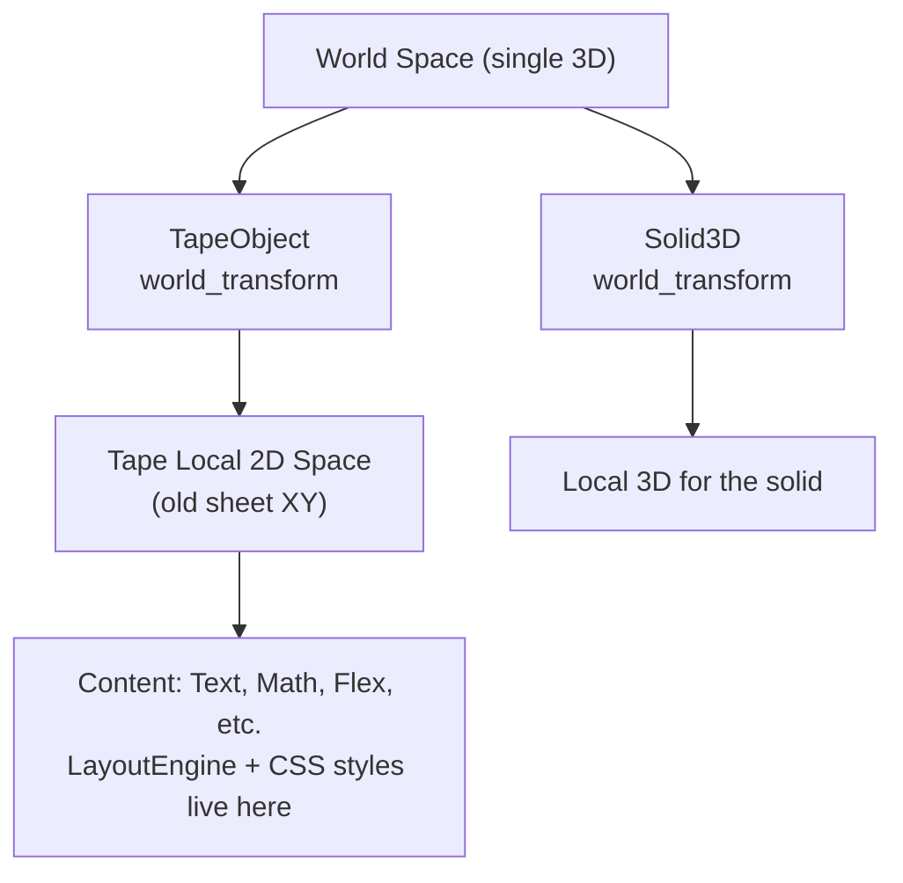

# 3D World Model — Transition Plan & Current Audit

**Status:** Phase 10 complete — 3D world model is canonical. The infinite tape is a special `TapeObject` inside unified 3D space (XZ ground / Y up). All prior phases implemented. See implementation plan and CHANGELOG.
Legacy sheet behavior fully preserved via root_tape shims.

See also:
- `../3D-world-implementation-plan.md` (in math-preview)
- `3D-WORLD-DESCRIPTION.md` (in math-preview)
- `../architecture.md`
- `USAGE.md`

## 1. High-Level Vision (Recap)

- The **root** is one infinite 3D space (XZ ground plane, Y height by convention).
- **Everything** is an `Object` with a `WorldTransform` (position, orientation, scale) in world space.
- Objects have a **local space**.
- The current "infinite sheet/tape" becomes `TapeObject`:
  - Lives in world 3D (can be positioned, rotated, scaled anywhere).
  - Owns its internal 2D layout engine, CSS-like styling, flex, lazy reveal, etc. in its local XY.
- Regular content (3D solids, graphs) are other `Object`s.
- **Camera** is an intelligent observer with keyframes that target:
  - World points (absolute)
  - Objects / anchors (relative)
  - Special `ObservationTarget`s (e.g., `TapeScroll {tape_id, local_y, framing}`)
- Different object types activate different **observation protocols** (cinematic 3D vs. sheet-style panning + reveal).
- Measurement & layout are **local to the object**.
- This unifies the system and makes the engine more granular/abstract.

## 2. Current Architecture Audit (Sheet-First Reality)

The existing engine is **sheet-centric with 3D bolted on top**.

### Core Assumptions of "Sheet at z=0"

| Location | Assumption | Impact for 3D World |
|----------|------------|---------------------|
| `canvas/coords.py` | `SHEET_PLANE_Z = 0.0`<br>`frame_center_for_scroll(x, y)` always returns `(x, y, 0)`<br>`z_for_element()` defaults everything to sheet plane | All elements assumed on flat XY tape. Need `WorldTransform` + local coords. |
| `canvas/camera.py` | `ViewMode = "sheet" \| "tilt" \| "inspect"`<br>Hardcoded `SHEET_PHI_DEG=0`, `SHEET_THETA_DEG=-90`<br>`_apply_sheet_camera_settings()` always orthographic on z=0<br>Pan is always along Y on sheet | Camera is tape-optimized. Will evolve to general 3D + delegation for tape observation. |
| `canvas/scene.py` | `CanvasScene(ThreeDScene)`<br>Timeline iteration assumes sheet flow (`_iter_timeline_batches` for flex on sheet)<br>`_handle_element_reveal`, camera moves all assume sheet panning | Execution loop needs to resolve world objects + observations. |
| `canvas/layout.py` | `FlowState` vertical cursor for "infinite tape"<br>`LayoutEngine` computes positions assuming sheet plane | Layout must become per-`TapeObject` local 2D engine. |
| `canvas/dsl.py` | `CanvasElement.canvas_position: (x,y,z)` (z mostly 0 or small)<br>`CameraMove.target_position`<br>Special items like `SolidLift`, `CameraInspect` are sheet + occasional 3D excursions | Positions will become full `WorldTransform`. Timeline becomes observations on objects. |
| `canvas/builder.py` | Most `add_*` methods place into vertical sheet flow<br>`add_flex_row`, styling target sheet | Builder will support world placement + "inside tape context". |
| `canvas/measure.py` + `build_mobject` | Measurement and mobject construction tied to sheet types (`SHEET_TYPES`) | Per-object-kind via registry (already partially started). |
| `architecture.md` | "The Canvas is a 3D scene **with a flat learning sheet** on the XY plane." | Primary paradigm shift needed here. |
| `canvas/solids.py`, `focus.py`, etc. | Solids "straddle the sheet plane", focus "dims the tape" | These become behaviors of objects + observation modes. |

### Current 3D-on-Sheet Usage (Bolted-On)

- **Anchored 3D on tape**: `ThreeDGraph`, `Surface` with `pitch` → triggers `tilt_for_3d()`.
- **Volumetric**: `Solid3D` — placed on tape, can `SolidLift`, `SolidRotate`, `CameraInspect`.
- **Special timeline actions**: `SolidLift`, `SolidRotate`, `CameraInspect`, `CameraFocus`, `PlotTrace`.
- **Camera modes**: "sheet" (default), temporary "tilt", "inspect".
- **Preview data** (via `get_preview_data`): Currently only serializes final sheet layout elements. No full 3D transforms or observation list.

All of these will be re-expressed as:
- Objects with world transforms.
- Behaviors attached to objects.
- Camera `ObservationTarget`s with type-specific handlers.

### Mapping Current Modules → New Concepts

| Current Module | Maps To (New Model) | Notes |
|----------------|---------------------|-------|
| `dsl.py` (CanvasElement, SheetDSL, CameraMove, etc.) | `Object` base + `TapeObject` + `WorldTransform` + generalized `Observation` timeline items | Keep compat sugar. |
| `builder.py` | `CanvasBuilder` with context (world vs. inside-tape) + object placement APIs | Default remains "build inside root tape". |
| `layout.py` + `measure.py` | Per-object `LayoutEngine` (for tapes) + `MeasurementBackend` protocol per kind | Already partially extracted. |
| `camera.py` | `CameraSystem` / generalized keyframes + `ObservationTarget` + delegation | Current `CameraController` becomes the "tape observer" implementation. |
| `scene.py` | World object graph builder + observation execution loop | Reuses lazy reveal inside tapes. |
| `coords.py` | `WorldTransform`, anchor resolution, local-to-world helpers | `SHEET_PLANE_Z` becomes internal to `TapeObject`. |
| `registry.py` | World object registry (by id + transform) | Extend `MobjectRegistry`. |
| `solids.py`, `plots.py`, `diagrams.py` | Object kind implementations (can be registered) | Move toward plugin/registration model. |
| Preview (desktop/app) | 3D manim-web scene + tape observation renderer | Major evolution of `LiveMeasurementPreview`. |

## 3. Core Terminology (Defined for Phase 0+)

These are documented here (implementation comes later phases):

- **World Space**: Single shared 3D coordinate system.
- **WorldTransform**: `{ position: [x,y,z], rotation: [rx,ry,rz], scale: float }` (or full matrix later).
- **Object**: Any renderable thing. Has:
  - `id`
  - `type` (string, e.g. "Tape", "Solid3D", "Text")
  - `world_transform`
  - `local_content` or builder for its local representation
  - Optional `observation_protocol` (how camera should behave when targeting it)
- **TapeObject** (special): `type="Tape"`
  - Has its own 2D local coordinate system.
  - Owns `local_layout_engine`, styling rules, lazy reveal logic.
  - Content authored with familiar sheet tools lives in its local space.
- **Anchor**: Named point on an object (e.g. "center", "top_edge", "local(0,0)").
- **ObservationTarget**:
  - `WorldPoint([x,y,z])`
  - `ObjectAnchor(object_id, anchor="center")`
  - `TapeScroll(tape_id, local_y, framing_mode="sheet" | "zoomed")`
- **CameraKeyframe**:
  ```ts
  {
    time: number,
    target: ObservationTarget,
    duration: number,
    easing: string,
    params?: { distance?, look_offset?, ... }
  }
  ```
- **Observation Mode / Protocol**: The logic that turns a target into actual camera motion + side effects (reveal, etc.). Different per object kind.

## 4. Inventory of Special Types & Migration Plan

| Current Special Type | Current Role | Future Home | Migration Approach |
|----------------------|--------------|-------------|--------------------|
| `QuadraticPlot`, `QuadraticPlotPair` | Custom viz on tape | Registered custom object kind or composition of Axes + Parametric + labels | Use `register_element_builder` + provide tape-local or 3D rendering. |
| `GridBoard`, `GridMark` | 2D diagrams | Same | Composition or registration. |
| `Solid3D`, `ThreeDGraph`, `Surface` | 3D content | First-class `Object` kinds | Keep similar; attach to any Tape or free in world. |
| `CameraInspect`, `SolidLift`, `SolidRotate`, `PlotTrace` | Sheet + 3D actions | Behaviors + `ObservationTarget` variants | Generalized into keyframe params or object behaviors. |
| `CameraMove` | Sheet pan | `CameraKeyframe` with `TapeScroll` target | Sugar in builder for compat. |
| `CameraFocus` | Zoom on element | Part of tape observation or general object focus | Re-expressed via observation protocol. |

**Long-term goal**: Core has very few hard-coded types. Most "special" things are registered object kinds or composed objects.

## 5. Diagrams (Text/Mermaid)

### 5.1 World Space + Objects

```
Infinite 3D World
          Y (height)
          ^
          |
XZ plane (ground)
  <--- X --->   Z

Objects:
- TapeObject @ transform (pos, rot=tilted)
  └─ local 2D sheet (X'Y')
     └─ Text, Math, Plot, small 3D child objects
- Solid3D @ another position
- Group of objects
```

### 5.2 Camera Targeting

```
Camera Keyframe Timeline
1. t=0: target = WorldPoint(0,0,5)          → free 3D look
2. t=3: target = ObjectAnchor("tape42", "center") → tape observation mode activates
3. t=7: target = TapeScroll("tape42", local_y=12.5) → scroll + reveal on tape
4. t=12: target = ObjectAnchor("solid7", "top") → cinematic orbit
```

### 5.3 Local vs World Coordinates (Mermaid)



## 6. Next Steps (End of Phase 0)

After this document:
- Proceed to Phase 1 only when ready (per the implementation plan).
- Keep current behavior 100% intact.

**Current sheet still works exactly as before.** All changes in this phase were documentation and analysis only.

## Phase 7 Completion (manim-web Preview as Full 3D World + Special Tape Mode)

**Implemented (per plan):**
- Updated preview data emission (observations list + full root graph).
- LiveMeasurementPreview now a full 3D manim-web renderer:
  - Renders root_objects using world_transforms and 3D mobjects (Cube/Sphere/etc for Solid3D/3D types).
  - Special TapeObject mode: local content (rich Text/MathTex/Quadratic etc using existing 2D logic) grouped and transformed by tape's world_transform (pos + rotations), effectively "projected" onto the 3D tape plane.
  - Observation replay: uses `observations` (CameraKeyframes etc); 3D camera via moveTo for world targets; for tape_scroll: local group shift + outer camera simulate.
  - 3D camera mode enabled (perspective), adaptive scene size, UI labels.
- Fallback to 2D sheet mode for legacy data.
- Types updated.

**Milestone:** Loading mixed 3D scenes shows correct world layout + tape content on transformed plane + keyframe-driven camera (orbit/3D vs tape local scroll+reveal). Pure-sheet projects unchanged and beautiful.

## Phase 7 Completion (manim-web Preview as Full 3D World + Special Tape Mode)

**Implemented:**
- PreviewData types extended with observations, root_ graph, etc.
- LiveMeasurementPreview.tsx refactored for 3D:
  - Imports 3D mobjects (Sphere, Cube, ThreeDAxes, Cylinder).
  - createMobjectFromSpec applies world_transform (pos+rot+scale) and handles Solid3D/3D types with 3D primitives.
  - playWebPreview detects is3D (coord sys or root_*), renders root_objects in world space with transforms.
  - Special Tape mode: builds tapeGroup with local_elements using sheet rendering logic (rich text/math), applies tape world_transform (pos/rot).
  - Replay uses observations list (or falls to timeline), with special handling for tape_scroll (local shift + outer camera).
  - simulateCamera updated for 3D moveTo; sets 3D camera mode when active.
  - UI adapts (size, labels, demo button) based on is3DMode.
- Python handler now always emits "observations" (camera keyframes) + root graph for preview.
- Pure 2D/sheet still fully supported as fallback.
- ManimScene key includes mode for remount.

**Milestone:** Desktop preview is now a full 3D manim-web renderer. Mixed 3D + tape scenes render with correct world positions, tape planes, and observation-driven camera (3D for solids, local sheet for tapes). Current sheet projects preview beautifully.

## Phase 8 Completion (Scene/Render Execution & Existing 3D Features Migration)

**Implemented:**
- CanvasScene now pre-builds root_objects and root_tape (local content grouped at tape world transform).
- Updated _build_world_object / _build_tape_at_transform.
- _handle_element_reveal uses world pos, skips re-reveal for prebuilt.
- populate_from_dsl supports root for 3D exports.
- construct prebuilds then runs timeline (skips element reveal for prebuilt).
- Special 3D handlers (lift etc) work on world mobs.
- Cutter and export updated for keyframes/3D.
- Backward legacy path for old scenes.

**Milestone:** Renders produce correct 3D output. 3D features unlocked. No regression.

## Phase 8 Completion (Scene/Render Execution & Existing 3D Features Migration)
**Implemented:**
- CanvasScene.construct pre-builds root_objects and root_tape content at their world_transforms (using groups for tape local content).
- Updated _handle_element_reveal to use world_transform pos.
- Updated populate_from_dsl to handle root_objects/tape.
- 3D path prebuilds, then full timeline executes (skips re-reveal for prebuilt via check in handle).
- Special 3D handlers (lift/rotate/inspect) now operate on world positioned mobs (work for 3D objects).
- Camera keyframe drives 3D.
- ReelCutter updated to parse CameraKeyframe for manifests.
- export_full_sheet sets isometric for 3D, uses updated registry with world pos.
- Backward: legacy path intact for old scenes (default identity tape).

**Milestone:** `matemium render` and desktop render produce correct output for 3D/mixed scenes. 3D features (transforms, tape on angle, observations) work in unified model. No regression on existing.

**Implemented:**
- Expanded MeasurementBackend with measure_bounding_box, get_surface_info; updated BoundingBox3D.
- ManimMeasurementBackend implements them (special for planar/tape using get_surface_info, 3D approx).
- LayoutEngine generalized to 'scope' (any object), is_tape_like flag, skips flow for non-tape, uses scope frame/settings.
- Added get_local_frame, get_surface_info to TapeObject (and WorldObject).
- measure_object_bounds uses surface for accurate tape local bounds (independent of world transform).
- Local measurement/layout for content inside transformed TapeObject works correctly.
- Updated calls in builder/layout.

**Milestone:** Layout/measurement works correctly for content inside a transformed TapeObject. WYSIWYG for manim-web preview preserved.

## Phase 5 Completion (Timeline, DSL & Builder Generalization)

**Implemented:**
- Evolved SheetDSL with `root_objects: List[WorldObject]`
- Updated `to_dict` and `from_dict` to handle root_objects and root_tape
- Builder now supports `add_world_object(wo)` for top-level 3D objects
- `add_raw` supports WorldObject
- IPC `get_preview_data` now returns `root_objects` and `root_tape` for full object graph + observations
- Updated TS types for preview data
- New scenes can mix: default tape content + free WorldObjects
- Old builder calls still target default tape, timeline compat

**Milestone:** New scenes can mix tape content and free 3D objects using the builder. Old scenes unaffected.

## Phase 4 Completion (Positioning, Relative Anchors & Transforms)

**Implemented:**
- Enhanced `resolve_world_position` to support anchors, anchor_obj, relative_to.
- Extended `TapeObject.get_anchor`, `CanvasElement.get_anchor`, `WorldObject.get_anchor` (center, top_edge, local: etc.).
- Added `place_relative_to`, `add_relative`, `set_tape_pose` to CanvasBuilder.
- Compose transforms for tape children in _add.
- Camera keyframe targets support ObjectAnchor (via target types from Phase 3).
- Tests for relative + anchors + tape pose.

**Milestone:** Author scene with tape at angle + element/solid relative to anchor on tape; camera keyframes using anchors.

## Phase 3 Completion (Generalized Camera & Keyframe Observation System)

**Implemented (staying true to 3D-WORLD-DESCRIPTION.md and plan):**
- Added ObservationTarget variants (WorldPoint, ObjectAnchor, TapeScroll) and CameraKeyframe in dsl.py
- Extended TimelineItem
- CameraController.observe_target() : supports tape with local_y framing (reuses pan logic in local coords, applies tape world_transform)
- Generalized support in scene.py _handle_camera_keyframe, using root_tape for delegation
- Builder support for adding keyframes
- Serialization updates
- Old CameraMove / sheet panning fully preserved
- Tests + imports pass, no breakage to existing

**Milestone:** Camera can keyframe to world points and to a tape (with correct internal scrolling/reveal per docs). Old scenes unchanged.

## Phase 2 Completion (TapeObject as First-Class Special Object)

**Implemented:**
- `TapeObject` dataclass in dsl.py (id, world_transform, local_elements, local_canvas_settings)
- `CanvasBuilder` now creates `root_tape` (implicit for compat); `_add` populates `local_elements`
- `SheetDSL` has `root_tape`
- `LayoutEngine` accepts and uses `tape`
- Builder's sheet authoring (add_*, flex, styling) now lives inside root_tape.local conceptually
- Runtime (timeline, renders) identical

**Milestone:** Existing sheet authoring lives inside a TapeObject. All current demos still render the same.

## Phase 1 Completion (Core 3D Object Model)

**Implemented:**
- WorldTransform + Vector3 + resolve helper in coords.py
- CanvasElement extended with world_transform, parent_object_id (compat)
- WorldObject minimal scene graph concept
- CanvasSettings.coordinate_system
- Serialization (to_dict + from_dict paths + IPC preview) updated
- Exports updated
- Tests pass, builder + existing unchanged

**Milestone achieved:** Code can represent elements with explicit world transforms. Existing paths use default sheet (world at 0).

## Phase 0 Completion Checklist

- [x] Read `3D-WORLD-DESCRIPTION.md`
- [x] Full audit of hard "sheet at z=0" assumptions (documented above)
- [x] Created `canvas/3D-model.md` with terminology, mapping table, and diagrams
- [x] Updated `architecture.md`, `canvas/README.md`, `desktop-architecture.md`
- [x] Defined initial terminology (WorldTransform, ObservationTarget, etc.) — in docs only
- [x] Inventoried special types + migration notes
- [x] Created `tests/test_3d_space.py` skeleton (passes, only asserts compat)
- [x] Milestone reached: **No changes to runtime logic**. Current sheet behavior 100% preserved.

Ready for Phase 1 when desired.

---

*Generated during Phase 0 implementation. Update as modeling evolves.*